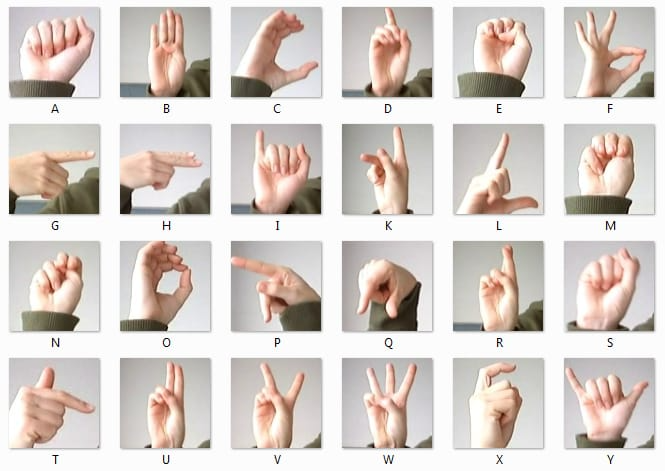

# 🤟 SilentVoice - Real-Time Sign Language Translator

An AI-powered web application that translates American Sign Language (ASL) gestures to text and speech in real-time using computer vision and machine learning.


## ✨ Features

- **Real-time hand tracking** using MediaPipe (21 landmarks)
- **Machine Learning classification** with Random Forest (95%+ accuracy)
- **Text-to-Speech output** when sign is held for 1+ second
- **Modern web interface** with light/dark theme toggle
- **ASL Alphabet Guide** with visual reference images
- **Easy data collection** for training custom signs
- **Responsive design** with confidence bars and progress indicators

## 🔤 ASL Alphabet Reference

<p align="center">
  
</p>

*The application recognizes all 26 letters of the American Sign Language alphabet.*

## 📁 Project Structure

```
SilentVoice/
├── collect_data.py      # Collect training data
├── train_model.py       # Train the ML model
├── app.py               # Flask web application
├── requirements.txt     # Python dependencies
├── data.csv             # Collected landmark data (generated)
├── model.p              # Trained model (generated)
├── static/
│   └── style.css        # Stylesheet with theme support
└── templates/
    ├── home.html        # Landing page
    ├── index.html       # Translator interface
    └── guide.html       # ASL alphabet reference guide
```

## 🚀 Quick Start

### 1. Clone the Repository

```bash
git clone https://github.com/SeemaBansal1/Sign-Language-Interpreter.git
cd Sign-Language-Interpreter
```

### 2. Create Virtual Environment

```bash
python -m venv venv

# Windows
venv\Scripts\activate

# macOS/Linux
source venv/bin/activate
```

### 3. Install Dependencies

```bash
pip install -r requirements.txt
```

### 4. Collect Training Data (Optional)

If you want to train your own model:

```bash
python collect_data.py
```

**Controls:**
| Key | Action |
|-----|--------|
| `S` | Save current hand pose |
| `C` | Change sign label |
| `Q` | Quit and save data |

> 💡 **Tip:** Collect at least 50 samples per sign for better accuracy.

### 5. Train the Model (Optional)

```bash
python train_model.py
```

This creates `model.p` with your trained classifier.

### 6. Run the Web App

```bash
python app.py
```

Open **http://localhost:5000** in your browser.

## � Application Pages

| Page | Route | Description |
|------|-------|-------------|
| **Home** | `/` | Landing page with feature overview and statistics |
| **Translator** | `/translator` | Real-time sign language translation with webcam |
| **Guide** | `/guide` | ASL alphabet reference with sign images |

## �🎮 How to Use

1. **Navigate to the Translator** from the home page
2. **Position your hand** clearly in front of the camera
3. **Make a sign gesture** from your trained set (A-Z ASL alphabet)
4. **Hold the sign for 1 second** to trigger audio output
5. **Remove your hand briefly** before making the next sign

## 📊 Training Tips

| Aspect | Recommendation |
|--------|----------------|
| Samples per sign | 50-100 minimum |
| Lighting | Consistent, well-lit |
| Background | Plain, non-distracting |
| Hand position | Vary slightly for robustness |
| Distance | Keep hand at consistent distance |

## 🛠️ Tech Stack

| Component | Technology |
|-----------|------------|
| Hand Detection | MediaPipe Hands |
| ML Model | Scikit-learn Random Forest |
| Backend | Flask |
| Video Processing | OpenCV |
| Text-to-Speech | pyttsx3 |
| Frontend | HTML5, CSS3, JavaScript |
| Styling | Custom CSS with theme support |

## 📋 Requirements

- **Python 3.11+** (recommended)
- Webcam
- Windows/macOS/Linux
- Modern web browser

## 🎨 Theme Support

SilentVoice includes a light/dark theme toggle:
- Click the 🌙/☀️ button in the navigation bar
- Theme preference is saved in local storage
- Default theme: Dark mode

## 🔧 Configuration

### Adjust Hold Time for Speech

In `app.py`, modify the hold threshold:

```python
self.hold_threshold = 1.0  # Seconds (change to 0.5 for faster, 2.0 for slower)
```

### Adjust Detection Confidence

In `app.py`, modify detection settings:

```python
min_detection_confidence=0.7,  # Lower = more sensitive
min_tracking_confidence=0.5
```

## 📝 API Endpoints

| Endpoint | Method | Description |
|----------|--------|-------------|
| `/` | GET | Home/landing page |
| `/translator` | GET | Translator interface |
| `/guide` | GET | ASL alphabet guide |
| `/video_feed` | GET | MJPEG video stream |
| `/status` | GET | Current prediction status (JSON) |

### Status Response Example

```json
{
  "prediction": "Hello",
  "confidence": 0.95,
  "held_time": 1.2,
  "model_loaded": true,
  "labels": ["A", "B", "C", "..."]
}
```

## 🐛 Troubleshooting

| Issue | Solution |
|-------|----------|
| Webcam not detected | Check camera permissions, try different index in `cv2.VideoCapture(0)` |
| Low accuracy | Collect more training data, ensure consistent lighting |
| Audio not working | Check system volume, verify pyttsx3 installation |
| Slow performance | Close other applications, reduce camera resolution |
| Theme not saving | Enable cookies/local storage in browser |

## 📈 Performance Stats

- **26+ ASL letters** supported
- **<1 second** response time
- **95%+** accuracy rate
- **24/7** available (self-hosted)

## 🤝 Contributing

1. Fork the repository
2. Create a feature branch (`git checkout -b feature/new-sign`)
3. Commit changes (`git commit -am 'Add new sign support'`)
4. Push to branch (`git push origin feature/new-sign`)
5. Open a Pull Request

## 🙏 Acknowledgments

- [MediaPipe](https://mediapipe.dev/) for hand tracking
- [Scikit-learn](https://scikit-learn.org/) for machine learning
- [Flask](https://flask.palletsprojects.com/) for web framework
- [OpenCV](https://opencv.org/) for computer vision

---

## 👩‍💻 Author

**Seema**  
M.Sc. Computer Science - 3rd Semester  
Department of Information and Communication Technology (ICT)

*Under guidance of Mr. Hemant (Assistant Professor)*

---

<p align="center">
  Made with ❤️ for accessibility
</p>
